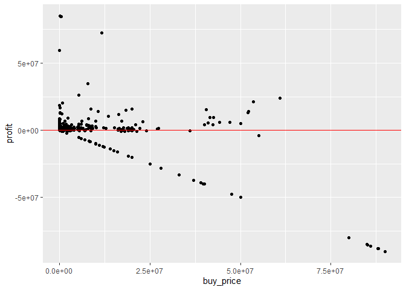
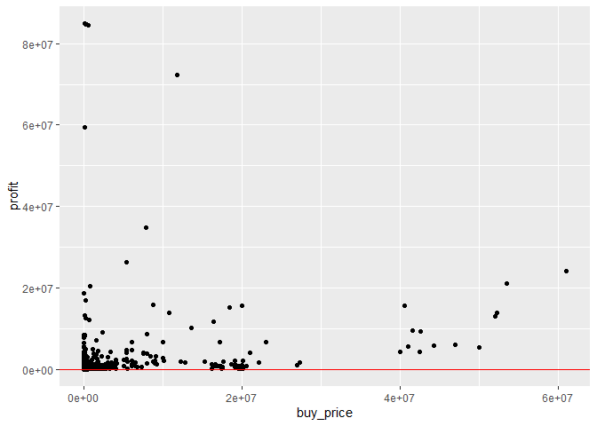
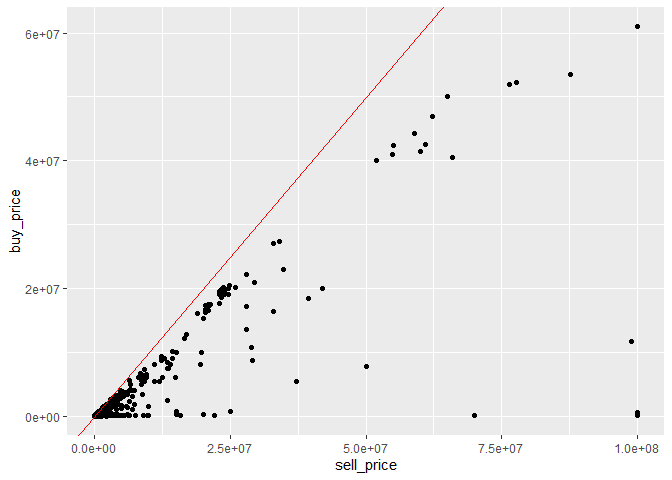
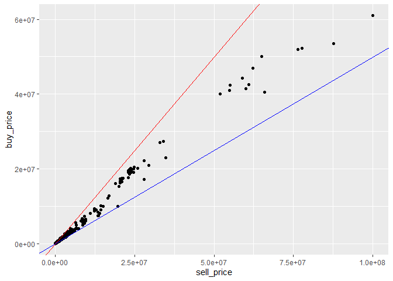
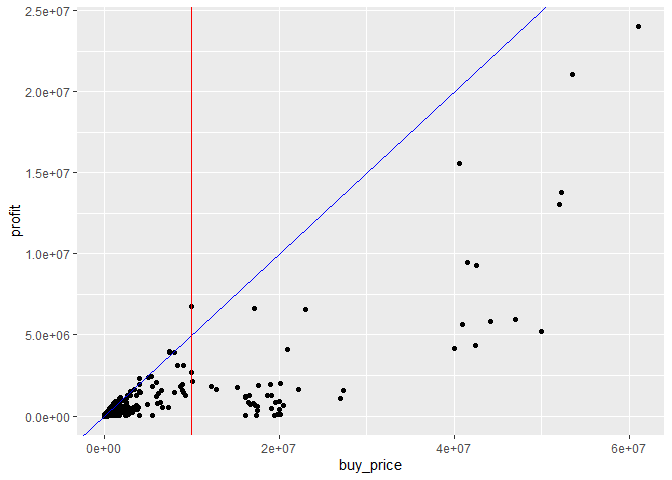
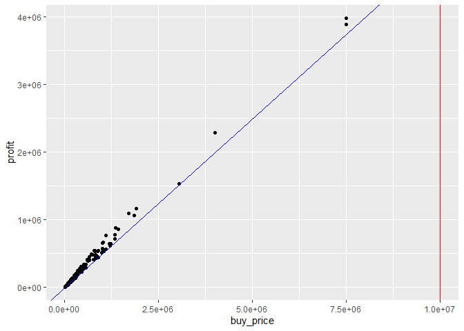

Investment Oportunities
================

#### This documents outlines the process of agrigating, cleaning, and analysing the Guild Wars 2 trading post data, taken from the Gw2 API (stored in local SQLite database). By the end of the document, we will have a list of all viable investment oportunities for flipping items on the Guild Wars 2 Trading Post.

## Data Retrieval

#### In this section, we connect to the database and query the necessary raw data. We retrieve the items’ information, including their names and values, as well as the price data, which includes buy and sell prices and quantities.

``` r
# Connect to the database
con <- dbConnect(SQLite(), dbname = "../data.db")

# Query the raw data from database
query <- "SELECT [id], [name], [value] FROM [items]"
items <- dbGetQuery(con, query)
query <- "SELECT [item_id], [buy_price], [buy_quantity], [sell_price], 
  [sell_quantity] FROM [prices]"
prices <- dbGetQuery(con, query)

# Close the database connection
dbDisconnect(con)
```

## Data Transformation

#### In this section, we merge the items and prices data to create the `item_data` dataframe. We handle missing values, replacing them with NPC vendor values. Then, we calculate the profit for flipping each item based on buy and sell prices. We also deduct the trade post tax (15% from sell value) from our profit value.

``` r
# Define item_data dataframe
item_data <- merge(
  items, prices, 
  by.x = "id", by.y = "item_id"
)

# Replace missing price values with vendor values
item_data$buy_price <- ifelse(
  is.na(item_data$buy_price), 
  item_data$value, 
  item_data$buy_price
)
item_data$sell_price <- ifelse(
  is.na(item_data$sell_price), 
  item_data$value, 
  item_data$sell_price
)

# Replace missing quantity value with 0
item_data$sell_quantity[is.na(item_data$sell_quantity)] <- 0
item_data$buy_quantity[is.na(item_data$buy_quantity)] <- 0

# Remove vendor value
item_data <- subset(item_data, select = -value)

# Add flipping profit column
item_data$profit <- ceiling((item_data$sell_price-1) * 0.85) -
  item_data$buy_price-1
```

    ## Rows: 27,143
    ## Columns: 7
    ## $ id            <int> 24, 68, 69, 70, 71, 72, 73, 74, 75, 76, 77, 78, 79, 80, …
    ## $ name          <chr> "Sealed Package of Snowballs", "Mighty Country Coat", "M…
    ## $ buy_price     <int> 183, 83, 32, 29, 35, 32712, 1913, 177, 1260, 43745, 17, …
    ## $ buy_quantity  <dbl> 402, 983, 222, 1491, 1, 2, 2, 220, 24, 12, 24, 287, 11, …
    ## $ sell_price    <int> 226, 97, 55, 44, 69, 99000, 4045, 1079, 1725, 103705, 35…
    ## $ sell_quantity <dbl> 7, 3, 1, 5, 1, 7, 2, 1, 1, 1, 2, 1, 2, 12, 2, 1, 5, 1, 1…
    ## $ profit        <dbl> 8, -2, 13, 7, 22, 51437, 1524, 739, 205, 44403, 11, 27, …

## Identifying Investment Opportunities

#### In this section, we filter the `item_data` to select items that are the most profitable. First let’s plot the `item_data` by profit acording to cost, with a reference line indicating profit loss.

<!-- -->

##### Let’s remove all data that would result in a net loss (bellow the red line) or that are not purchaseable. Also if multiple items have the same buy price, we choose the one with the highest profit.

``` r
# Create dataframe of investment opportunities
investments <- item_data %>%
  # Filter out items that are not profitable
  filter(profit > 0, buy_quantity > 0) %>%
  
  # If two items cost the same, take highest profit
  group_by(buy_price) %>%
  slice_max(profit) %>%
  ungroup()
```

<!-- -->

##### Some of these options are not fesable as a sale because the price is too high. For example, the highest profitable item right now has a purchase demand of 12g 1s 17c and a sell value of 10000g 0s 0c! That will never sell because the gap between the buy price and the sell price is too large.

##### Let’s plot the buy price and sell price to see the difference between them with a reference line indicating the instant sell/buy line: when the buy value and sell value are equal.

<!-- -->

##### Now, we can further refine our list of the investment opportunities by filtering out items that have a sell price exceeding twice the buy price. Reference line in blue.

``` r
# Refine investments
investments <- investments %>%
  # Filter out items that have a sell price of more than 2x the buy price
  filter(sell_price <= buy_price * 2)
```

<!-- -->

##### Finally we have a list of items that are profitable and possible to sell. Now we can filtering out lower-profit items that have a profit less than 50% of buy price (blue). We also remove items with a buy price higher than 1000 gold (red).

<!-- -->

``` r
# Refine investments
investments <- investments %>%
  # Filter out items with profit less than 50% of buy price
  filter(profit >= buy_price * 0.5) %>%
  # Filter out low profit and high cost items
  filter(profit > 10000, buy_price < 10000000)
```

<!-- -->

# Conclusion

#### We have our results! We managaged to filter our results from 27143 to 403 potential investments.

##### Below is a list of the highest profit items with the recommened purchasing and listing prices along with the calucalated net profit. These items typically take a while to sell and occationally you can become “outbid” by someone else: high risk, high reward.

| Name                                   | Buy          | Sell          | Profit       |
|:---------------------------------------|:-------------|:--------------|:-------------|
| Endless Designer Hoodie Clothing Tonic | 750g 19s 47c | 1350g 99s 96c | 398g 15s 50c |
| +17 Agony Infusion                     | 750g 1s 6c   | 1339g 99s 99c | 388g 98s 94c |
| Deathly Bull’s Mantle Skin             | 400g 13s 0c  | 739g 99s 99c  | 228g 87s 0c  |
| Mini Bioluminescent Skyscale Hatchling | 305g 10s 44c | 539g 99s 99c  | 153g 89s 56c |
| Mini Mist Shadow Tigris Cub            | 190g 2s 79c  | 360g 99s 94c  | 116g 82s 16c |
| Unopened Endless Choya Piñata Tonic    | 170g 9s 8c   | 329g 8s 53c   | 109g 63s 18c |
| Phospholuminescent Infusion            | 186g 2s 5c   | 343g 99s 99c  | 106g 37s 95c |
| Traitor’s Crown of the Cavalier        | 134g 61s 62c | 261g 61s 60c  | 87g 75s 74c  |
| Chaos Sword Skin                       | 142g 89s 65c | 269g 99s 98c  | 86g 60s 34c  |
| Mini Stardust Jackal Pup               | 134g 5s 57c  | 249g 99s 98c  | 78g 44s 42c  |

##### Additionally here is a list of items with a high purchasing demand. These items typically sell fast and but have a lower proft value: low risk, low reward.

| Name                                | Buy         | Sell        | Profit      |
|:------------------------------------|:------------|:------------|:------------|
| Swim-Speed Infusion +16             | 10g 60s 43c | 18g 99s 96c | 5g 54s 54c  |
| Bringer’s Exalted Coat              | 5g 1s 13c   | 9g 88s 94c  | 3g 39s 47c  |
| Shaman’s Etched Short Bow of Vision | 1g 54s 1c   | 2g 99s 95c  | 1g 0s 95c   |
| Swim-Speed Infusion +18             | 40g 0s 49c  | 74g 99s 94c | 23g 74s 46c |
| Ley Line Short Bow Skin             | 18g 24s 56c | 32g 99s 93c | 9g 80s 39c  |
| Rampager’s Destroyer Axe            | 13g 1s 12c  | 25g 98s 75c | 9g 7s 82c   |
| Defiant Glass Hammer Skin           | 7g 3s 21c   | 13g 99s 99c | 4g 86s 79c  |
| Zodiac Focus Skin                   | 8g 27s 15c  | 14g 81s 61c | 4g 32s 22c  |
| Sinister Exalted Mantle             | 4g 4s 34c   | 7g 64s 92c  | 2g 45s 85c  |
| Vallog’s Demise                     | 3g 53s 95c  | 6g 99s 89c  | 2g 40s 96c  |

# Next Steps

#### There is no garentee that any of these items will sell or be purchased because the market tends to flucuate. I am currently working on creating a historical database to calculate a fullfilment probability percentage based on purchasing history. There is also the possiblity of implamenting a basic AI program for future trend prediction depending on how much data I can collect.
